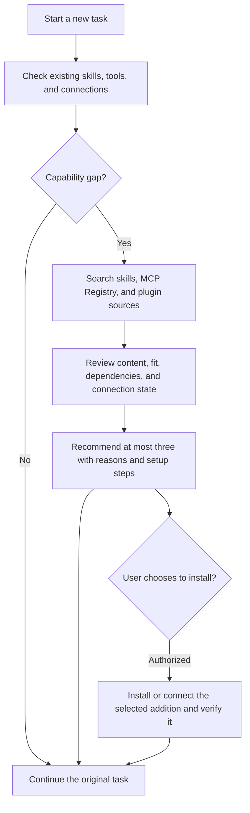

# Skill Scout

[English](README.md) | [繁體中文](README.zh-TW.md)

**Find useful skills, MCP servers, and plugins before starting a task.**

Skill Scout first checks available skills, tools, and connected services. It then searches several sources for useful additions, reviews the candidates, and explains why they may help. It recommends at most three additions across all types. The user decides what to install or connect.

| Type | What it provides | Examples |
| --- | --- | --- |
| Skill | Reusable workflows and specialized instructions | PDF creation, Android testing, React performance reviews |
| MCP server | Tools or data connections for an agent | GitHub operations, document search, database queries |
| Plugin | A bundle of skills, MCP servers, or service connections | Drive, Figma, specialized development tools |

When a plugin already includes the needed skill or MCP integration, Scout prefers a sufficient single solution to avoid duplicate installations.

Designed for Codex, with instructions that other agents supporting `SKILL.md` can also follow. The discovery script requires **Node.js 22+** and has no third-party runtime dependencies.



## What is included

| Component | Implemented functionality |
| --- | --- |
| [Skill](skills/skill-scout/SKILL.md) | Pre-task checks, discovery across sources, candidate review, recommendations, and installation authorization |
| [Discovery tool](skills/skill-scout/scripts/scout.mjs) | Read local skills, GitHub skill/plugin metadata, and the MCP Registry; return categorized JSON |
| [AGENTS.md snippet](skills/skill-scout/references/AGENTS.snippet.md) | Instruct the agent to use Scout before a new task |
| [Source guide](skills/skill-scout/references/sources.md) | Official repositories, skills.sh, MCP Registry, plugin directories, and fallback behavior |
| [Review and installation guide](skills/skill-scout/references/review-and-install.md) | Candidate types, overlapping capabilities, dependencies, permissions, and installation/connection state |
| [Tests](test/scout.test.mjs) | Offline behavior, ranking, duplicate names, source failures, deadlines, input validation, and CLI behavior |

## Quick start

Download this repository and run from its root:

```bash
node skills/skill-scout/scripts/scout.mjs --query "github"
```

Search local skills only:

```bash
node skills/skill-scout/scripts/scout.mjs --query "android testing" --offline
```

All three types are searched by default. You can select one type:

```bash
node skills/skill-scout/scripts/scout.mjs --query "pdf forms" --kind skills
node skills/skill-scout/scripts/scout.mjs --query "github" --kind mcp
node skills/skill-scout/scripts/scout.mjs --query "google drive" --kind plugins
```

No `npm install` is needed. The script returns metadata; it does not install candidates, run plugin hooks, or connect to discovered MCP endpoints.

For Chinese requests, the agent extracts short English capability keywords. For example, a request to test Android app screens becomes `android screenshot testing`. The script uses keyword matching and includes no LLM, translation service, or paid API.

## Installation and pre-task invocation

1. Open a terminal in the **target project** where you want to use Scout:

   ```bash
   npx skills add kenktchau-cmyk/skill-scout --skill skill-scout --agent codex
   ```

   Installation defaults to project scope. The first `npx` invocation may download the Skills CLI. A local source also works: `npx skills add "/path/to/skill-scout" --skill skill-scout --agent codex`. To avoid a package manager, manually copy the entire `skills/skill-scout` folder into the target project's `.agents/skills/skill-scout`, preserving its subdirectories. Do not overwrite an existing skill with the same name.

2. Merge the [AGENTS.snippet.md](skills/skill-scout/references/AGENTS.snippet.md) block into the target project's `AGENTS.md`, preserving existing instructions. Add it only once.
3. Start a new task and confirm that the agent has loaded the project instructions. You can also ask explicitly:

   > Use $skill-scout to look for useful skills, MCP servers, or plugins before working on this task. For worthwhile additions, explain the benefit, dependencies, and installation or connection steps.

**Automatic invocation depends on the agent following `AGENTS.md`.** Implicit invocation alone does not guarantee a discovery pass every time. This project includes no background service or runtime hook that forcibly intercepts tasks. Small changes, continuing tasks, and work already covered by available skills skip external discovery. See [OpenAI's AGENTS.md documentation](https://learn.chatgpt.com/docs/agent-configuration/agents-md) and [skill loading and invocation](https://learn.chatgpt.com/docs/build-skills).

## Discovery sources

By default, the script reads:

- Project and user `.agents/skills`, `.codex/skills`, and `.claude/skills` directories. The Codex user directory respects `CODEX_HOME`.
- [OpenAI skills](https://github.com/openai/skills).
- [Anthropic skills](https://github.com/anthropics/skills).
- [Vercel agent-skills](https://github.com/vercel-labs/agent-skills).
- [The official MCP Registry](https://registry.modelcontextprotocol.io/) for the latest server-version metadata.
- [OpenAI plugins](https://github.com/openai/plugins) for actual plugin manifests.

Scout also instructs the agent to supplement these sources with available host plugin-directory search, [skills.sh](https://skills.sh/), GitHub, and publisher documentation. Website search links generated by the script are marked `not-searched`; generating a link does not mean it was opened. Neither the OpenAI plugin repository nor a host's recommended list is a complete plugin directory.

Use custom sources and local roots:

```bash
node skills/skill-scout/scripts/scout.mjs --query "deployment" --kind skills --repo your-team/skills --repo another-team/skills
node skills/skill-scout/scripts/scout.mjs --query "calendar" --kind plugins --plugin-repo your-team/plugins
node skills/skill-scout/scripts/scout.mjs --query "testing" --root "/path/to/team-skills" --offline
```

The repeatable `--repo`, `--plugin-repo`, and `--root` options **replace** their respective default lists. The script does not scan entire drives. When run from a subdirectory, it does not automatically find ancestor project directories; supply them with `--root`. It does not inspect plugin caches or MCP configuration that may contain secrets. The agent checks existing tools and connections through the host.

## Recommendation example

This illustrates the format; it is not a completed candidate review:

> I found a skill that may help with this React performance task. After reviewing it, its guidance can help check data loading, bundles, and rendering behavior. Source: [Vercel React Best Practices](https://github.com/vercel-labs/agent-skills/tree/main/skills/react-best-practices). If you choose to install it, use the command below. I will continue with the current capabilities in the meantime.

```bash
npx skills add vercel-labs/agent-skills --skill vercel-react-best-practices --agent codex
```

Before recommending a skill, inspect its `SKILL.md` and relevant scripts. For MCP, verify the publisher, transport, endpoint, required authorization, and dependencies. For plugins, inspect the bundle and the actual host-directory ID. Installing a plugin may not finish account connection; report those states separately. Stars, registry status, and brand names do not establish a completed review. Do not invent metrics or installation commands.

## Results and limitations

- `schemaVersion: 2`: `installed` contains relevant local skills; `candidates` contains leading results across types. Each item has `kind: skill / mcp / plugin`.
- `candidateGroups` lists candidates for each type. The agent's final recommendations remain limited to three in total.
- MCP/plugin `installed: null` and `connectionState: unknown` mean unverified. `inventoryCoverage` reminds the agent to check connection state through the host.
- `possibleInstalledOverlaps` identifies remote skills with a same-named local skill for source and purpose comparison. It does not remove a same-named MCP server or plugin. New same-named candidates from different publishers are retained for review.
- `sources` records successful, missing, partial, or failed source checks.
- `blobSha` identifies the fetched metadata version. `sourceUrl` points to the current default branch, which may change; review it again before installation.
- The script lists at most three new candidates by default. Use `--limit 1` through `--limit 20` to adjust its output. The agent still recommends no more than three.
- GitHub filtering starts with skill/plugin directory names and reads at most eight metadata files per repository. The MCP Registry searches server names using at most four keywords and reads up to 20 first-page entries per keyword. A following page is reported as partial coverage. These are not complete semantic searches.
- Remote requests share a 15-second deadline, adjustable with `--timeout-ms` up to 60 seconds. Connection failures, GitHub rate limits, and unsupported metadata are reported without blocking the original task or automatically retrying.
- There is no persistent cache or preference database across tasks. Within a task, the agent remembers searches and declined suggestions.

The script issues GET requests only to `api.github.com` and `registry.modelcontextprotocol.io`. **The MCP Registry receives up to four public capability keywords**; GitHub receives only repository/blob requests. An optional `GITHUB_TOKEN` is sent only to `api.github.com`, never to the registry or candidate endpoints. Local files, full task text, and configuration are not transmitted. `--offline` makes no network requests; information about existing MCP/plugin connections must still come from the host.

## Development and validation

```bash
node --test
```

Tests use Node's built-in test runner and mocked network responses, alongside separate real-source checks. Results and boundaries are in the [validation report](qa/REPORT.md). Candidate safety, OAuth, MCP tool availability, and invocation in a new agent task require independent verification.

This project is MIT licensed. Discovered third-party skills, MCP servers, and plugins retain their own licenses.
