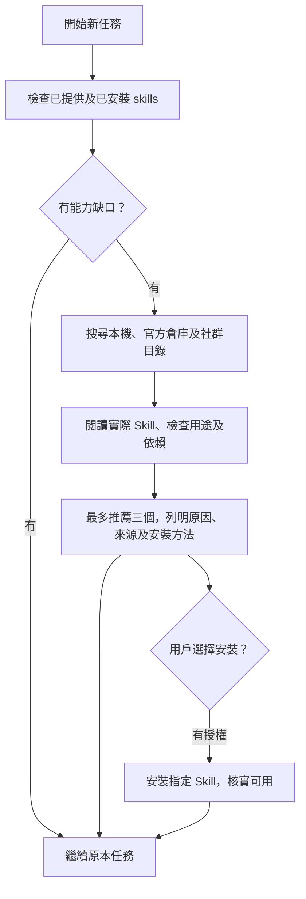

# Skill Scout

**做任務之前，先搵有冇值得用嘅 skills。**

Skill Scout 會先檢查現有能力，再從多個來源搵相關 agent skills，檢查候選內容，向用戶解釋點解值得安裝。搜尋工具只讀資料；安裝由用戶決定。

適合 Codex 使用，亦可以由其他支援 `SKILL.md` 嘅 agent 按指引執行。搜尋程式需要 **Node.js 22+**，冇第三方 runtime dependencies。



## 有啲乜

| 部分 | 已實作功能 |
| --- | --- |
| [Skill](skills/skill-scout/SKILL.md) | 任務前檢查、多來源搜尋、閱讀候選、推薦同安裝授權流程 |
| [搜尋工具](skills/skill-scout/scripts/scout.mjs) | 掃描本機 skills，讀取 GitHub 倉庫嘅真實 Skill metadata，輸出 JSON |
| [AGENTS.md 設定段落](skills/skill-scout/references/AGENTS.snippet.md) | 指示 agent 喺新任務開始前使用 Scout |
| [來源指引](skills/skill-scout/references/sources.md) | 官方倉庫、skills.sh、GitHub 同工具不可用時嘅做法 |
| [測試](test/scout.test.mjs) | 離線、排名、重複名稱、來源失敗、逾時、輸入驗證及 CLI 行為 |

## 快速試用

下載呢個 repository，喺 repository 根目錄執行：

```bash
node skills/skill-scout/scripts/scout.mjs --query "pdf forms"
```

只搜尋本機：

```bash
node skills/skill-scout/scripts/scout.mjs --query "android testing" --offline
```

唔需要 `npm install`。程式只輸出資料，唔會安裝任何候選 skill。

中文任務由 agent 提取簡短英文能力關鍵字，例如「幫 Android app 做畫面測試」→ `android screenshot testing`。工具本身採用關鍵字比對，冇內置 LLM、翻譯服務或付費 API。

## 安裝及任務前觸發

1. 喺你想使用 Scout 嘅**目標專案**開終端機。將以下路徑換成下載咗嘅 repository 路徑：

   ```bash
   npx skills add "/path/to/skill-scout" --skill skill-scout --agent codex
   ```

   呢個係 Skills CLI 嘅本機來源安裝方式，預設專案範圍。首次使用 `npx` 可能下載 Skills CLI；如唔想用套件管理器，可以將 `skills/skill-scout` 整個資料夾手動複製到目標專案 `.agents/skills/skill-scout`，保留所有子目錄。唔好覆寫同名現有 skill。

2. 將 [AGENTS.snippet.md](skills/skill-scout/references/AGENTS.snippet.md) 嘅段落合併到目標專案 `AGENTS.md`，保留原有指引，加入一次就夠。
3. 開新任務，確認 agent 已讀到專案指引。你亦可以直接講：

   > 用 $skill-scout，先睇吓有冇 skills 幫到手，再幫我做呢個任務。有值得裝嘅就講原因同安裝方法。

**自動觸發由 agent 遵從 `AGENTS.md` 實現。** 單靠 implicit invocation 唔保證每次執行；呢個專案冇背景服務或強制攔截任務嘅 runtime hook。細修改、延續中任務、已經有合適 skills 嘅工作會略過外部搜尋。[OpenAI AGENTS.md 文件](https://learn.chatgpt.com/docs/agent-configuration/agents-md)、[Skill 載入及觸發方式](https://learn.chatgpt.com/docs/build-skills)。

## 會去邊度搵

搜尋程式預設讀取：

- 本專案同用戶目錄嘅 `.agents/skills`、`.codex/skills`、`.claude/skills`；Codex 用戶目錄尊重 `CODEX_HOME`。
- [OpenAI skills](https://github.com/openai/skills)。
- [Anthropic skills](https://github.com/anthropics/skills)。
- [Vercel agent-skills](https://github.com/vercel-labs/agent-skills)。

Scout 嘅指引另外會叫 agent 使用可用嘅搜尋／瀏覽工具查 [skills.sh](https://skills.sh/) 同 GitHub，補充官方倉庫以外嘅候選。程式只會產生呢兩類搜尋連結，標示為 `not-searched`；佢唔會假裝已經搜尋過。

自訂來源同本機位置：

```bash
node skills/skill-scout/scripts/scout.mjs --query "deployment" --repo your-team/skills --repo another-team/skills
node skills/skill-scout/scripts/scout.mjs --query "testing" --root "/path/to/team-skills" --offline
```

`--repo` 同 `--root` 可以重複使用，會**取代**各自預設清單。唔會掃描全個硬碟；由子目錄執行時，程式唔會自動向上搵祖先專案目錄，可用 `--root` 指定。Host 已提供嘅 plugin skills 由 agent 先檢查，程式唔會掃描 plugin cache。

## 推薦會點樣講

以下係格式示例，唔係今次已完成嘅候選評審：

> 搵到一個可能幫到今次 React 效能調整嘅 skill。檢查內容後，佢可以協助檢查資料載入、bundle 同 render 行為。來源：[Vercel React Best Practices](https://github.com/vercel-labs/agent-skills/tree/main/skills/react-best-practices)。如果你決定安裝，可以用以下指令；我會先用現有能力繼續工作。

```bash
npx skills add vercel-labs/agent-skills --skill vercel-react-best-practices --agent codex
```

實際推薦要先讀候選 `SKILL.md` 同相關 scripts、檢查環境依賴及用途重疊。Star 數、安裝量同品牌名唔代表完成審核；唔會為咗推薦而虛構數字。

## 搜尋結果同限制

- `installed`：本機有關候選；`candidates`：未經評審嘅遠端線索。
- `possibleInstalledOverlaps`：同名本機 skill 已存在，需要比較來源及用途；唔會當成新安裝推薦。同名但不同作者嘅新候選會保留，交畀 agent 比較。
- `sources`：每個來源嘅成功、缺失、部分結果或失敗狀態。
- `blobSha`：今次讀取嘅 metadata 版本；`sourceUrl` 指向目前預設分支，之後內容可能更新，安裝前要重新核對。
- 預設只列最多三個新候選，可用 `--limit 1` 至 `--limit 20` 調整工具輸出。Agent 仍然最多推薦三個。
- 遠端先按資料夾名稱篩選，每倉庫最多讀八份 metadata，唔保證涵蓋所有可能有用嘅 skill。來源清單唔代表已審核所有內容。
- 遠端要求共用 15 秒期限，可用 `--timeout-ms` 調整，最高 60 秒。連線失敗、GitHub rate limit、無法理解嘅 metadata 會回報，唔會卡住任務或自動重試。
- 冇持久快取或跨任務偏好資料庫；同一任務內由 agent 記住搜尋同用戶拒絕嘅建議。

搜尋工具只向 `api.github.com` 發出 GET，公開倉庫唔需要 token。可選 `GITHUB_TOKEN` 只會傳到該 host。程式會下載 metadata 後喺本機比對，唔會傳送任務文字、本機檔案或關鍵字；agent 另外使用搜尋服務時，只應提交可公開嘅能力關鍵字。

## 開發及驗證

```bash
node --test
```

測試使用 Node 內置 test runner，網絡情境用模擬回應；亦做過真實公開 GitHub metadata 測試。結果及邊界見 [驗證紀錄](qa/REPORT.md)。GitHub 發佈、Skills CLI 安裝同新 agent 任務觸發，要喺目標環境另行驗證。

專案以 MIT 授權發佈；搜尋到嘅第三方 skills 各自使用其原本授權。
