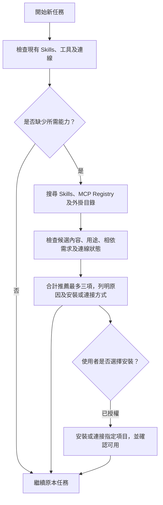

# Skill Scout

[English](README.md) | [繁體中文](README.zh-TW.md)

**在執行任務前，集中搜尋合適的 Skills、MCP 伺服器及外掛程式。**

Skill Scout 會先檢查現有的 Skills、工具及已連接的服務，再從多個來源搜尋有用的擴充功能，審查候選項目，並向使用者說明推薦原因。三種類型合計最多推薦三項，是否安裝或連接則由使用者決定。

| 類型 | 用途 | 範例 |
| --- | --- | --- |
| Skill | 可重複使用的工作流程及專門指引 | PDF 製作、Android 測試、React 效能檢查 |
| MCP 伺服器 | 向代理程式提供工具或資料連接 | GitHub 操作、文件搜尋、資料庫查詢 |
| Plugin／外掛 | 封裝 Skills、MCP 或服務連線 | Drive、Figma、專門開發工具 |

如果某個外掛已包含所需的 Skill 或 MCP 整合，Scout 會優先考慮能滿足需求的單一方案，避免重複安裝。

本專案適用於 Codex，其他支援 `SKILL.md` 的代理程式也可以遵循指引執行。搜尋程式需要 **Node.js 22+**，沒有第三方執行階段相依套件。



## 專案內容

| 元件 | 已實作功能 |
| --- | --- |
| [Skill](skills/skill-scout/SKILL.md) | 任務前檢查、多來源搜尋、候選項目審查、推薦及安裝授權流程 |
| [搜尋工具](skills/skill-scout/scripts/scout.mjs) | 讀取本機 Skills、GitHub Skill／Plugin 中繼資料及 MCP Registry，輸出分類 JSON |
| [AGENTS.md 設定段落](skills/skill-scout/references/AGENTS.snippet.md) | 指示代理程式在新任務開始前使用 Scout |
| [來源指引](skills/skill-scout/references/sources.md) | 官方儲存庫、skills.sh、MCP Registry、外掛目錄及搜尋失敗時的替代方式 |
| [審查及安裝指引](skills/skill-scout/references/review-and-install.md) | 區分候選類型、重疊能力、相依需求、權限及安裝／連線狀態 |
| [測試](test/scout.test.mjs) | 離線行為、排名、重複名稱、來源失敗、逾時、輸入驗證及 CLI 行為 |

## 快速開始

下載此儲存庫後，在根目錄執行：

```bash
node skills/skill-scout/scripts/scout.mjs --query "github"
```

只搜尋本機 Skills：

```bash
node skills/skill-scout/scripts/scout.mjs --query "android testing" --offline
```

預設會搜尋全部三種類型，也可以指定單一類型：

```bash
node skills/skill-scout/scripts/scout.mjs --query "pdf forms" --kind skills
node skills/skill-scout/scripts/scout.mjs --query "github" --kind mcp
node skills/skill-scout/scripts/scout.mjs --query "google drive" --kind plugins
```

不需要執行 `npm install`。程式只輸出中繼資料，不會安裝候選項目、執行外掛掛鉤，或連接搜尋到的 MCP 端點。

對於中文任務，代理程式會擷取簡短的英文能力關鍵字，例如將「為 Android 應用程式進行畫面測試」轉為 `android screenshot testing`。工具本身採用關鍵字比對，沒有內建 LLM、翻譯服務或付費 API。

## 安裝及任務前觸發

1. 在需要使用 Scout 的**目標專案**中開啟終端機：

   ```bash
   npx skills add kenktchau-cmyk/skill-scout --skill skill-scout --agent codex
   ```

   預設安裝範圍為目前專案。首次使用 `npx` 可能會下載 Skills CLI。本機來源也可以使用 `npx skills add "/path/to/skill-scout" --skill skill-scout --agent codex`。若不使用套件管理器，可將整個 `skills/skill-scout` 資料夾手動複製至目標專案的 `.agents/skills/skill-scout`，並保留所有子目錄。請勿覆寫現有的同名 Skill。

2. 將 [AGENTS.snippet.md](skills/skill-scout/references/AGENTS.snippet.md) 中的段落合併至目標專案的 `AGENTS.md`，保留原有指引，且只加入一次。
3. 開啟新任務，確認代理程式已載入專案指引。也可以明確要求：

   > 請使用 $skill-scout，在執行此任務前搜尋可能有用的 Skills、MCP 伺服器或外掛。如果有值得加入的項目，請說明用途、相依需求，以及安裝或連接方式。

**自動觸發依賴代理程式遵循 `AGENTS.md`。** 單靠隱式呼叫並不能保證每次都執行搜尋。本專案沒有背景服務，也沒有強制攔截任務的執行階段掛鉤。小幅修改、延續中的任務，以及現有 Skills 已能處理的工作，會略過外部搜尋。詳見 [OpenAI AGENTS.md 文件](https://learn.chatgpt.com/docs/agent-configuration/agents-md)及 [Skill 載入與觸發方式](https://learn.chatgpt.com/docs/build-skills)。

## 搜尋來源

搜尋程式預設讀取：

- 專案及使用者目錄中的 `.agents/skills`、`.codex/skills`、`.claude/skills`；Codex 使用者目錄依照 `CODEX_HOME` 設定。
- [OpenAI skills](https://github.com/openai/skills)。
- [Anthropic skills](https://github.com/anthropics/skills)。
- [Vercel agent-skills](https://github.com/vercel-labs/agent-skills)。
- [官方 MCP Registry](https://registry.modelcontextprotocol.io/)：搜尋最新版本的伺服器中繼資料。
- [OpenAI plugins](https://github.com/openai/plugins)：讀取實際外掛資訊清單。

Scout 也會指示代理程式使用所在平台提供的外掛目錄搜尋、[skills.sh](https://skills.sh/)、GitHub 及供應商文件，補充候選項目。程式產生的網站搜尋連結會標示為 `not-searched`；產生連結不代表已開啟或搜尋該網站。OpenAI 外掛儲存庫與平台推薦清單都不是完整的外掛目錄。

指定自訂來源及本機位置：

```bash
node skills/skill-scout/scripts/scout.mjs --query "deployment" --kind skills --repo your-team/skills --repo another-team/skills
node skills/skill-scout/scripts/scout.mjs --query "calendar" --kind plugins --plugin-repo your-team/plugins
node skills/skill-scout/scripts/scout.mjs --query "testing" --root "/path/to/team-skills" --offline
```

`--repo`、`--plugin-repo` 及 `--root` 可以重複使用，並會**取代**各自的預設清單。程式不會掃描整個硬碟；從子目錄執行時，也不會自動向上尋找上層專案目錄，請使用 `--root` 明確指定。程式不會讀取外掛快取或可能包含機密資訊的 MCP 設定；現有工具及連線狀態由代理程式透過所在平台檢查。

## 推薦範例

以下僅示範推薦格式，不代表已完成候選項目審查：

> 找到一個可能有助於本次 React 效能調整的 Skill。經過內容審查後，其指引可協助檢查資料載入、套件組合及畫面渲染行為。來源：[Vercel React Best Practices](https://github.com/vercel-labs/agent-skills/tree/main/skills/react-best-practices)。如果你決定安裝，可以使用以下指令；在此期間，我會使用現有能力繼續工作。

```bash
npx skills add vercel-labs/agent-skills --skill vercel-react-best-practices --agent codex
```

實際推薦 Skill 前，應先閱讀其 `SKILL.md` 及相關腳本。對於 MCP，應核實發布者、傳輸方式、端點、所需授權及相依需求。對於外掛，應檢查封裝內容及平台目錄中的實際 ID。安裝外掛後，帳戶連線可能仍未完成，兩種狀態應分別說明。Star 數量、Registry 狀態及品牌名稱不代表已完成審查，也不應虛構數字或安裝指令。

## 搜尋結果及限制

- `schemaVersion: 2`：`installed` 包含相關的本機 Skills，`candidates` 包含跨類型排名較前的候選線索；每項都有 `kind: skill / mcp / plugin`。
- `candidateGroups` 分別列出三種類型的候選項目；代理程式最終仍合計最多推薦三項。
- MCP／Plugin 的 `installed: null` 及 `connectionState: unknown` 表示尚未確認。`inventoryCoverage` 會提醒代理程式透過所在平台查詢連線狀態。
- `possibleInstalledOverlaps` 表示本機已存在同名 Skill，需要比較來源及用途。它不會移除同名的 MCP 伺服器或外掛。不同發布者提供的同名新候選會保留，交由代理程式比較。
- `sources` 記錄各來源的成功、缺失、部分結果或失敗狀態。
- `blobSha` 識別此次讀取的中繼資料版本；`sourceUrl` 指向目前的預設分支，其內容可能在之後更新，安裝前應重新核對。
- 預設最多列出三個新候選，可使用 `--limit 1` 至 `--limit 20` 調整工具輸出數量。代理程式仍最多推薦三項。
- GitHub 搜尋會先按 Skill／Plugin 資料夾名稱篩選，每個儲存庫最多讀取八份中繼資料。MCP Registry 最多使用四個關鍵字搜尋伺服器名稱，每個關鍵字最多讀取首頁 20 項結果；若存在下一頁，會標示為部分涵蓋。這些搜尋方式並非完整的語意搜尋。
- 遠端請求共用 15 秒期限，可透過 `--timeout-ms` 調整，最高為 60 秒。連線失敗、GitHub 請求頻率限制及無法解析的中繼資料都會回報，但不會阻礙原本任務或自動重試。
- 沒有持久快取或跨任務偏好資料庫。同一任務內的搜尋紀錄及使用者拒絕的建議由代理程式記錄。

搜尋工具只向 `api.github.com` 及 `registry.modelcontextprotocol.io` 發出 GET 請求。**MCP Registry 會收到最多四個公開能力關鍵字**；GitHub 只會收到儲存庫／blob 請求。可選的 `GITHUB_TOKEN` 只會傳送至 `api.github.com`，不會轉交 Registry 或候選端點。程式不會傳送本機檔案、完整任務文字或設定。使用 `--offline` 時完全不會發出網絡請求；現有 MCP／外掛連線資訊仍須由所在平台提供。

## 開發及驗證

```bash
node --test
```

測試使用 Node 內建測試執行器，網絡情境使用模擬回應，並另行檢查真實來源。結果及驗證範圍見[驗證紀錄](qa/REPORT.md)。候選項目的安全性、OAuth、MCP 工具可用性，以及新代理程式任務中的觸發行為，均需要獨立核實。

本專案採用 MIT 授權。搜尋到的第三方 Skills、MCP 伺服器及外掛各自保留原有授權。
