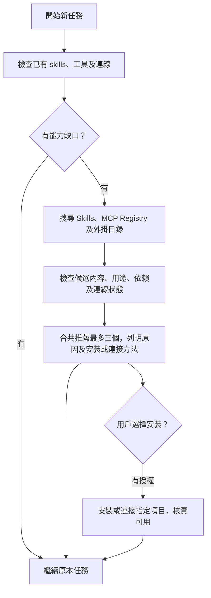

# Skill Scout

[English](README.md) | [繁體中文](README.zh-TW.md)

**做任務之前，一次過搵合適嘅 Skills、MCP servers 同外掛程式。**

Skill Scout 會先檢查現有 skills、工具同已連接服務，再從多個來源搵有用嘅擴充能力，檢查候選內容，向用戶解釋點解值得加入。三類合共最多推薦三個；安裝同連接由用戶決定。

| 類型 | 幫到啲乜 | 例子 |
| --- | --- | --- |
| Skill | 可重用嘅做事流程同專門指引 | PDF 製作、Android 測試、React 效能檢查 |
| MCP server | 向 agent 提供工具或資料連接 | GitHub 操作、文件搜尋、資料庫查詢 |
| Plugin／外掛 | 封裝 skills、MCP 或服務連線 | Drive、Figma、專門開發工具 |

如果一個外掛已經包含需要嘅 Skill 或 MCP，會優先考慮一個足夠用嘅方案，避免重複安裝。

適合 Codex 使用，亦可以由其他支援 `SKILL.md` 嘅 agent 按指引執行。搜尋程式需要 **Node.js 22+**，冇第三方 runtime dependencies。



## 有啲乜

| 部分 | 已實作功能 |
| --- | --- |
| [Skill](skills/skill-scout/SKILL.md) | 任務前檢查、多來源搜尋、閱讀候選、推薦同安裝授權流程 |
| [搜尋工具](skills/skill-scout/scripts/scout.mjs) | 掃描本機 skills、GitHub Skill／Plugin metadata，同 MCP Registry，輸出分類 JSON |
| [AGENTS.md 設定段落](skills/skill-scout/references/AGENTS.snippet.md) | 指示 agent 喺新任務開始前使用 Scout |
| [來源指引](skills/skill-scout/references/sources.md) | 官方倉庫、skills.sh、MCP Registry、外掛目錄同搜尋降級方法 |
| [評審及安裝指引](skills/skill-scout/references/review-and-install.md) | 分清三類候選、重疊能力、依賴、權限及安裝／連線狀態 |
| [測試](test/scout.test.mjs) | 離線、排名、重複名稱、來源失敗、逾時、輸入驗證及 CLI 行為 |

## 快速試用

下載呢個 repository，喺 repository 根目錄執行：

```bash
node skills/skill-scout/scripts/scout.mjs --query "github"
```

只搜尋本機：

```bash
node skills/skill-scout/scripts/scout.mjs --query "android testing" --offline
```

預設搜尋三類。亦可以指定類型：

```bash
node skills/skill-scout/scripts/scout.mjs --query "pdf forms" --kind skills
node skills/skill-scout/scripts/scout.mjs --query "github" --kind mcp
node skills/skill-scout/scripts/scout.mjs --query "google drive" --kind plugins
```

唔需要 `npm install`。程式只輸出 metadata，唔會安裝候選、執行外掛 hooks，或者連接搜尋到嘅 MCP endpoint。

中文任務由 agent 提取簡短英文能力關鍵字，例如「幫 Android app 做畫面測試」→ `android screenshot testing`。工具本身採用關鍵字比對，冇內置 LLM、翻譯服務或付費 API。

## 安裝及任務前觸發

1. 喺你想使用 Scout 嘅**目標專案**開終端機：

   ```bash
   npx skills add kenktchau-cmyk/skill-scout --skill skill-scout --agent codex
   ```

   預設專案範圍。首次使用 `npx` 可能下載 Skills CLI；本機來源亦可以用 `npx skills add "/path/to/skill-scout" --skill skill-scout --agent codex`。如唔想用套件管理器，可以將 `skills/skill-scout` 整個資料夾手動複製到目標專案 `.agents/skills/skill-scout`，保留所有子目錄。唔好覆寫同名現有 skill。

2. 將 [AGENTS.snippet.md](skills/skill-scout/references/AGENTS.snippet.md) 嘅段落合併到目標專案 `AGENTS.md`，保留原有指引，加入一次就夠。
3. 開新任務，確認 agent 已讀到專案指引。你亦可以直接講：

   > 用 $skill-scout，先睇吓有冇 Skills、MCP 或外掛幫到手，再幫我做呢個任務。有值得加嘅就講原因、依賴同安裝或連接方法。

**自動觸發由 agent 遵從 `AGENTS.md` 實現。** 單靠 implicit invocation 唔保證每次執行；呢個專案冇背景服務或強制攔截任務嘅 runtime hook。細修改、延續中任務、已經有合適 skills 嘅工作會略過外部搜尋。[OpenAI AGENTS.md 文件](https://learn.chatgpt.com/docs/agent-configuration/agents-md)、[Skill 載入及觸發方式](https://learn.chatgpt.com/docs/build-skills)。

## 會去邊度搵

搜尋程式預設讀取：

- 本專案同用戶目錄嘅 `.agents/skills`、`.codex/skills`、`.claude/skills`；Codex 用戶目錄尊重 `CODEX_HOME`。
- [OpenAI skills](https://github.com/openai/skills)。
- [Anthropic skills](https://github.com/anthropics/skills)。
- [Vercel agent-skills](https://github.com/vercel-labs/agent-skills)。
- [官方 MCP Registry](https://registry.modelcontextprotocol.io/)：搜尋最新版本嘅 server metadata。
- [OpenAI plugins](https://github.com/openai/plugins)：讀取實際外掛 manifest。

Scout 嘅指引另外會叫 agent 用可用嘅 host 外掛目錄搜尋、[skills.sh](https://skills.sh/)、GitHub 同供應商文件，補充候選。程式產生嘅網站搜尋連結標示為 `not-searched`；唔會假裝已經打開。OpenAI plugin repo 同 host 推薦清單都唔係完整外掛目錄。

自訂來源同本機位置：

```bash
node skills/skill-scout/scripts/scout.mjs --query "deployment" --kind skills --repo your-team/skills --repo another-team/skills
node skills/skill-scout/scripts/scout.mjs --query "calendar" --kind plugins --plugin-repo your-team/plugins
node skills/skill-scout/scripts/scout.mjs --query "testing" --root "/path/to/team-skills" --offline
```

`--repo`、`--plugin-repo` 同 `--root` 可以重複使用，會**取代**各自預設清單。唔會掃描全個硬碟；由子目錄執行時，程式唔會自動向上搵祖先專案目錄，可用 `--root` 指定。程式唔會讀取 plugin cache 或可能包含秘密嘅 MCP config；現有工具同連線由 agent 透過 host 檢查。

## 推薦會點樣講

以下係格式示例，唔係今次已完成嘅候選評審：

> 搵到一個可能幫到今次 React 效能調整嘅 skill。檢查內容後，佢可以協助檢查資料載入、bundle 同 render 行為。來源：[Vercel React Best Practices](https://github.com/vercel-labs/agent-skills/tree/main/skills/react-best-practices)。如果你決定安裝，可以用以下指令；我會先用現有能力繼續工作。

```bash
npx skills add vercel-labs/agent-skills --skill vercel-react-best-practices --agent codex
```

實際推薦 Skill 要先讀 `SKILL.md` 同相關 scripts；MCP 要核實 publisher、transport、endpoint、所需授權及依賴；外掛要檢查 bundle 同 host 目錄嘅實際 ID。外掛安装可以仍未完成帳戶連線，會分開講清楚。Star 數、Registry 狀態同品牌名唔代表完成審核，唔會虛構數字或安裝指令。

## 搜尋結果同限制

- `schemaVersion: 2`；`installed` 係本機有關 skills，`candidates` 係跨類型排前嘅線索；每項有 `kind: skill / mcp / plugin`。
- `candidateGroups` 按三種類型各列候選；Agent 最終推薦仍然合共最多三個。
- MCP／Plugin 嘅 `installed: null` 同 `connectionState: unknown` 表示未確認。`inventoryCoverage` 提醒 agent 要經 host 查連線狀態。
- `possibleInstalledOverlaps`：同名本機 skill 已存在，需要比較来源及用途；唔會誤將同名 MCP／外掛移除。不同作者嘅同名新候選會保留，交畀 agent 比較。
- `sources`：每個來源嘅成功、缺失、部分結果或失敗狀態。
- `blobSha`：今次讀取嘅 metadata 版本；`sourceUrl` 指向目前預設分支，之後內容可能更新，安裝前要重新核對。
- 預設只列最多三個新候選，可用 `--limit 1` 至 `--limit 20` 調整工具輸出。Agent 仍然最多推薦三個。
- GitHub 先按 Skill／Plugin 資料夾名稱篩選，每倉庫最多讀八份 metadata。MCP Registry 按最多四個關鍵字搜尋 server 名稱，每詞最多讀首頁 20 項，有下一頁會標記部分覆蓋。呢啲都唔係完整語意搜尋。
- 遠端要求共用 15 秒期限，可用 `--timeout-ms` 調整，最高 60 秒。連線失敗、GitHub rate limit、無法理解嘅 metadata 會回報，唔會卡住任務或自動重試。
- 冇持久快取或跨任務偏好資料庫；同一任務內由 agent 記住搜尋同用戶拒絕嘅建議。

搜尋工具只向 `api.github.com` 同 `registry.modelcontextprotocol.io` 發出 GET。**MCP Registry 會收到最多四個公開能力關鍵字**；GitHub 只收到倉庫／blob 要求。可選 `GITHUB_TOKEN` 只傳到 `api.github.com`，唔會轉交 Registry 或候選 endpoint。程式唔會傳送本機檔案、完整任務文字或設定。`--offline` 完全唔發網絡要求；MCP／外掛現有連線仍需 host 提供資料。

## 開發及驗證

```bash
node --test
```

測試使用 Node 內置 test runner，網絡情境用模擬回應；亦做真實來源測試。結果及邊界見 [驗證紀錄](qa/REPORT.md)。候選嘅安全性、OAuth、MCP 工具可用性同新 agent 任務觸發需要獨立核實。

專案以 MIT 授權發佈；搜尋到嘅第三方 Skills、MCP servers 同外掛各自使用其原本授權。

